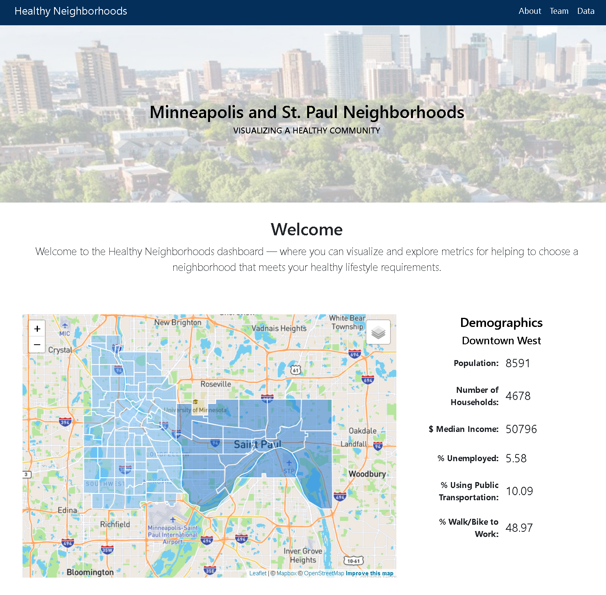

# Project-2-Healthy-Neighborhoods

This dashboard demonstrates how to integrate Flask with HTML and JavaScript code. This project will note run on LiveServer, a Flask server must be used.

---

## Directions
Please clone this repository and then do the following:

1. Peruse the files and the project directory structure in the cloned directory to get familier with the project methodology. Note the use of the ``templates`` and ``static`` folders. 
1. Navigate to the folder that contains the ``config.js`` file.  Go to https://www.mapbox.com/ and sign up for an API key. Copy that API key and place in in the ``config.js`` file.
1. Navigate to the folder that contains ``app.py`` and launch a GitBash (Windows) or Terminal (Mac). 
1. Type ``source activate PythonData`` and then hit ENTER.
1. Type ``Jupyter Notebook`` and then hit ENTER.
1. In Jupyter Notebook, open the file, ``Project 2 ETL notebook.ipynb`` and run all the cells. This will store all data needed for the site in a database. IS THE POSTGRES USER/PW STORED IN THE JUPYTER NOTEBOOK? DOES THAT NEED TO BE ADDED HERE? SEE THE "IMPORTANT" NOTES BELOW. BEST TO INTEGRATE THOSE NOTES INTO THE NUMBERED LIST.
1. Open ``python app.py`` and update the PostgreSQL username and password to match your own values. 
1. Type ``python app.py`` and then hit ENTER.
1. Observe that the Flask server starts and tells you which port it's running on. Don't close this window.
1. With the Flask server running, enter this address in your Chrome browser: http://127.0.0.1:5000/. You'll see that it loads the index page. 
1. Click the link that says "Click here for the other page!" You'll notice that Chrome loads a new page containing a list of available routes. 
1. If you navigate to the following address, you'll see that it returns a JSON: http://127.0.0.1:5000/dictionary. This is an example of an API endpoint you'd use to get data into your JavaScript file for graphing and analysis. 
1. If you navigate to the following address, you'll see that it returns another JSON, this time from a database query: http://127.0.0.1:5000/fighteraircraft This is another example of an API endpoint. Please read the code in ``app.py`` to see how this all works. 

Additional notes: INTEGRATE THE FOLLOWING NOTES INTO THE LIST ABOVE WHERE APPROPRIATE.

* *IMPORTANT:* Note about needing to run the Jupyter Notebook to get the database.
* *IMPORTANT:* You'll have to update the PostgreSQL username and password (``app.py``) so that they match your own values. You likely have the same username, but your password will (probably) be different.

---

## Project Team
* Nick Buller
* Kerry Harp
* Sofanit Mengesha